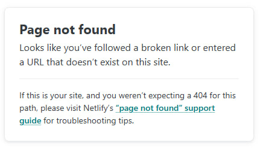

# BUGS

# ID бага BUG-001

## Общая информация
| Поле | Значение |
|------|----------|
| **Приоритет** | Средний |
| **Окружение** | Браузер: Chrome 123.0, OS: Windows 10 |
| **Тест-кейс** | TC-DESK-07 |
| **Статус** | Open |

## Описание проблемы
**Краткое описание:** 
Кнопка **Сбросить** не сбрасывает категории.

**Шаги воспроизведения:**
1. Выбрать любую категорию
2. Нажать кнопку **Сбросить**

**Фактический результат:**
Не меняется надпись у категорий на sidebar'е, не меняются объявления в списке (остаются только те, что входят в категорию)

**Ожидаемый результат:**
Категория сбросится: надпись на sidebar'e будет **"Все категории"**, а в списке объявлений будут карточки объявлений со всеми категориями

## Логи / Консоль

```bash
Error: Фильтр категории должен быть сброшен на "Все категории"

expect(received).toBe(expected) // Object.is equality

Expected: ""
Received: "0"

at D:\Code\QA-Avito-test_work\tests\desktop\TC-DESK-07.ts:31:90
```

# ID бага BUG-002

## Общая информация
| Поле | Значение |
|------|----------|
| **Приоритет** | Высокий |
| **Окружение** | Браузер: Chrome 123.0, OS: Windows 10 |
| **Тест-кейс** | TC-DESK-08, TC-DESK-09 |
| **Статус** | Open |

## Описание проблемы
**Краткое описание:** 
Тогл **Только срочные** не работает на вкл/вкл

**Шаги воспроизведения:**
1. Включить / выключить тогл **Только срочные** 

**Фактический результат:**
Ничего не меняется, кроме визуальной работы тогла

**Ожидаемый результат:**
При включении отображаются объявления с знаком приоритета **"Срочно"**
При выключении отображаются объявления со всеми знаками приоритета

## Логи / Консоль

TC-DESK-08
```bash
Error: Количество объявлений (10) не совпадает с количеством индикаторов "Срочно" (6)

expect(received).toBe(expected) // Object.is equality

Expected: 10
Received: 6

at HomePage.assertAllItemsHaveUrgentIndicator (D:\Code\QA-Avito-test_work\pages\homePage\homePage.ts:365:14)
at D:\Code\QA-Avito-test_work\tests\desktop\TC-DESK-08.ts:23:9
```

TC-DESK-09
```bash
Error: После выключения тогла количество объявлений должно увеличиться

expect(received).toBeGreaterThan(expected)

Expected: > 10
Received:   10

at D:\Code\QA-Avito-test_work\tests\desktop\TC-DESK-09.ts:28:14
```

# ID бага BUG-003

## Общая информация
| Поле | Значение |
|------|----------|
| **Приоритет** | Средний |
| **Окружение** | Браузер: Chrome 123.0, OS: Windows 10 |
| **Тест-кейс** | TC-DESK-10 |
| **Статус** | Open |

## Описание проблемы
**Краткое описание:** 
Одно из объявлений выходит из диапазона в фильтре по цене

**Шаги воспроизведения:**
1. Выставить ограничение **"До"** 50 000

**Фактический результат:**
Есть объявление с ценой 51 605

**Ожидаемый результат:**
Все объявления должны быть не дороже 50 000

## Логи / Консоль

TC-DESK-10
```bash
Error: Цена объявления 10 (51605) выше максимальной границы 50000

expect(received).toBeLessThanOrEqual(expected)

Expected: <= 50000
Received:    51605

at HomePage.assertAllPricesAreInRange (D:\Code\QA-Avito-test_work\pages\homePage\homePage.ts:397:18)
at D:\Code\QA-Avito-test_work\tests\desktop\TC-DESK-10.ts:28:9
```

# ID бага BUG-004

## Общая информация
| Поле | Значение |
|------|----------|
| **Приоритет** | Высокий |
| **Окружение** | Браузер: Chrome 123.0, OS: Windows 10 |
| **Тест-кейс** | - |
| **Статус** | Open |

## Описание проблемы
**Краткое описание:** 
Сайт падает при попытке зайти на страницу статистики через ```/stats```

**Шаги воспроизведения:**
1. Вставить в поисковую строку ссылку ```https://cerulean-praline-8e5aa6.netlify.app/stats```

**Фактический результат:**
Ошибка\


**Ожидаемый результат:**
Страница должн загружаться корректно. Так же, как и при нажатии кнопки **"Статистика"** на главной странице

# ID бага BUG-005

## Общая информация
| Поле | Значение |
|------|----------|
| **Приоритет** | Высокий |
| **Окружение** | Браузер: Chrome 123.0, OS: Windows 10 |
| **Тест-кейс** | TC-STAT-03 |
| **Статус** | Open |

## Описание проблемы
**Краткое описание:** 
Кнопка возобновления таймера НЕ работает

**Шаги воспроизведения:**
1. Зайти на страицу **"Статистика"**
2. Поставить таймер на паузу
3. Попробовать возобновить таймер нажатием на ту же кнопку, но с другой иконкой

**Фактический результат:**
Ничего не происходит

**Ожидаемый результат:**
Надпись пропадает, иконка кнопки меняется, появляется таймер с идущим временем

## Логи / Консоль

TC-STAT-03
```bash
Error: Таймер должен быть активным

expect(received).toBe(expected) // Object.is equality

Expected: true
Received: false

at StatisticPage.assertTimerIsActive (D:\Code\QA-Avito-test_work\pages\statisticsPage\statisticsPage.ts:85:75)
at D:\Code\QA-Avito-test_work\tests\desktop\TC-STAT-03.ts:21:9
```